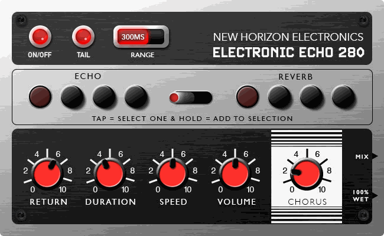

# Electronic Echo 280

**Dark, dense, deliberately unnatural. The 1977 bucket-brigade box that glues anything you feed it, now on your MOD.**

Electronic Echo 280 by New Horizon Electronics recreates the Dynacord EC 280 Electronic Echo for MOD Duo, Duo X and Dwarf. It is modelled from the original service schematic: eight bucket-brigade chips, four taps, a resistor-matrix "reverb" and a chorus driven by noise.



## Why it sounds like nothing else

- **A virtual bucket brigade, not a clean delay.** The line runs on its own clock (about 6.8–51 kHz), so the top end rolls off around 3 kHz, repeats alias and blur, and turning Speed bends pitch.
- **Reverb made of echoes.** Each Reverb button mixes a spread of taps into a deep, smeared, distinctly artificial space.
- **Random chorus.** Filtered noise, not an LFO, drifts the clock: warped, unpredictable, flanger-ish when pushed.
- **Feedback with an edge.** Every repeat goes back through the filters and a soft clip. Past about 7.7 on Duration it wakes up on its own.

## Demo

Noodling through various settings: https://drive.google.com/drive/folders/1-QZxZeC3tDU7mIAqthf-zzfm8aizpxSD

Some noodling With Taj Mahal Reverb: https://drive.google.com/file/d/15tuiynCKkmkl26nR78CGV9Mnj607NK_n/view?usp=drive_link

## Controls

| Control | What it does |
| --- | --- |
| Return | Echo level added on top of the dry signal |
| Duration | Feedback; self-oscillates near the top |
| Speed | Delay time (clock rate), with a 27 ms glide, so moves bend pitch |
| Volume | Input preamp: drives the echo and the dry signal, unity at 5, +12 dB at 10 |
| Chorus | Depth of the random clock drift |
| Echo buttons E1–E4 | Choose which taps feed back (E1 longest, E4 shortest); the echo you hear is always the longest tap |
| Reverb buttons R1–R4 | Choose the tap mixes for reverb mode |
| Echo / Reverb toggle | Which button bank is live |
| Range | 300 ms (the original's eight chips) or 600 ms (a "deluxe" 16-chip version with the same tone); switching mid-play glitches like hardware |
| Tail | On: bypass lets the repeats ring out. Off: bypass cuts and clears them |
| On/Off | Bypass |

**Buttons:** tap = that button only (radio, like the original). Hold about half a second, or shift-click, to add or remove a button: the "press several at once" hack.

Mono in, two outputs: **Mix** (dry + echo, the original's "Output") and **100% Wet** (echo only, the original's "Delay out"). They are not a stereo pair.

Ten factory presets are included.

## Install

**Test builds:** upload `mod-plugin-builder/nhe-ec280/nhe-ec280.mk` to <https://builder.mod.audio/buildroot> with your MOD connected over USB, then click Install. Set `NHE_EC280_VERSION` in that file to the commit you want to build.

**MOD Plugin Store:** not yet. See [docs/release.md](docs/release.md).

## Build from source

```sh
make                 # builds bin/nhe-ec280.lv2
make install DESTDIR=/path PREFIX=/usr
```

DPF (DISTRHO Plugin Framework) is a git submodule in `dpf/`, pinned at commit `61d38eb638449647fb8395a35c5b8dab7e981ba7`. Clone with `git clone --recursive`, or run `git submodule update --init --recursive` after cloning. Cross-compile by setting `CC`, `CXX` and `CXXFLAGS` as usual.

Testing, the pedal-face workflow and the release checklist are in [docs/development.md](docs/development.md).

## Repository layout

| Path | Contents |
| --- | --- |
| `plugins/ec280/` | DSP source (C++, DPF) |
| `bundle/nhe-ec280.lv2/` | LV2 metadata, factory presets, pedal face (template, CSS, script, images) |
| `assets/source/` | Source artwork and mockup for the face |
| `mod-plugin-builder/` | Package file for MOD's builder and plugin store |
| `tools/` | Offline LV2 test host, audio test suite, face click test, face renderer, knob filmstrip maker |
| `docs/` | Circuit notes, sound and quirks, development process, release checklist |
| `dpf/` | DISTRHO Plugin Framework, git submodule (ISC) |

## Licence

Code: MIT ([LICENSE](LICENSE)). Artwork: © New Horizon Electronics ([ARTWORK-LICENSE.md](ARTWORK-LICENSE.md)). DPF: ISC ([dpf/LICENSE](dpf/LICENSE)).

Dynacord is a trademark of its owner. This is an independent recreation, not affiliated with or endorsed by them.
